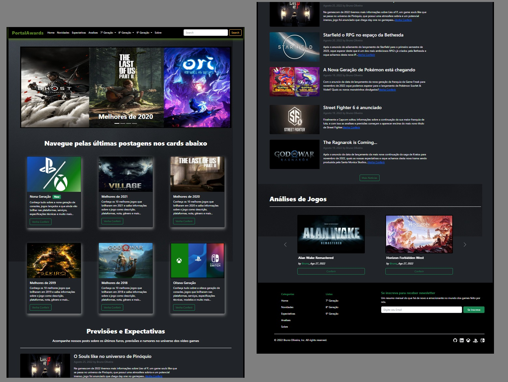
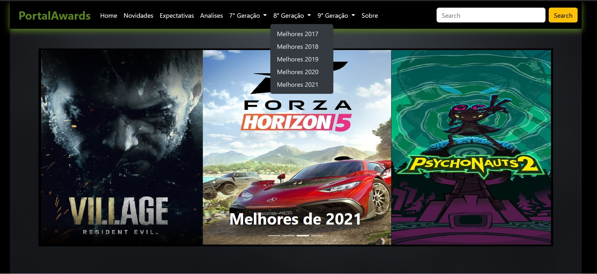

## 📝 Projet game-awards

-Projeto de criação de um web-site gamer que possa oferecer uma experiência agradavel ao usuário.

## 💻 Screenshot do projeto

Designer 01

Designer 02

<h4 align="center"><a href="https://brunooliveira16.github.io/the-game-awards/">Clique aqui e visite o projeto</a></h4>

## 📚 Descrição
O projeto consiste em um web site que possui a missão de trazer conteúdo relevante para o público gamer em geral, possuindo tópicos como:
- **lista de dez melhores jogos:** Oferece uma experiência organizada por ano de lançamento, podendo visualizar os dez melhores do período.
- **Gerações de Consoles:** Informações base dos concoles lançados das diferentes gerações.
- **Portal de Noticias:** experiência com o intuito de fornecer as noticias mais relevantes e previsões do mundo dos games.
- **Analise de Jogos:** conteúdo voltado para descrever a experiência obtida em determinado jogo.

---

## 💼 Tecnologias utilizadas
- HTML5
- CSS3
- JavaScript
- Bootstrap V5.2.0
- jQuery V3.6.0

---

## 🙋🏻‍♂️ Autor

Bruno Oliveira
